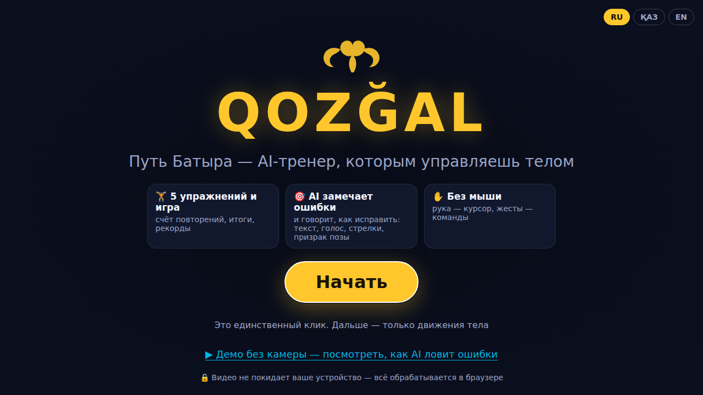
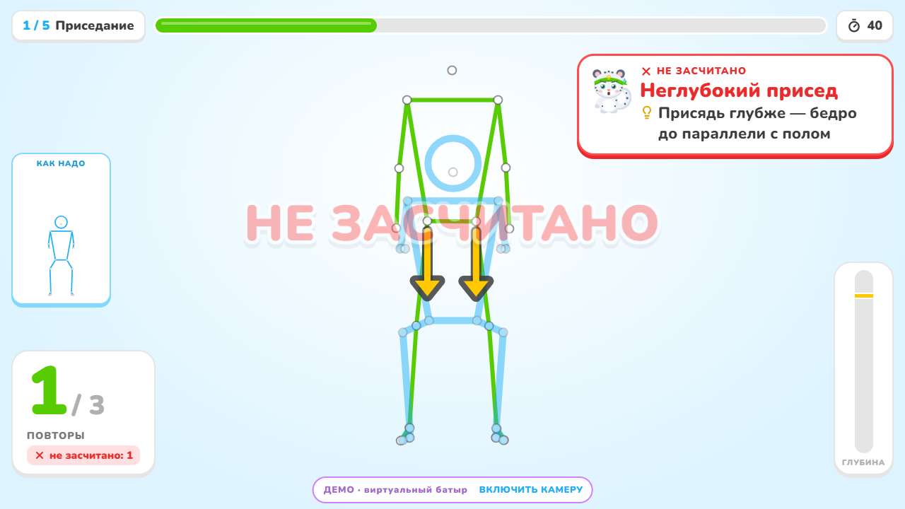
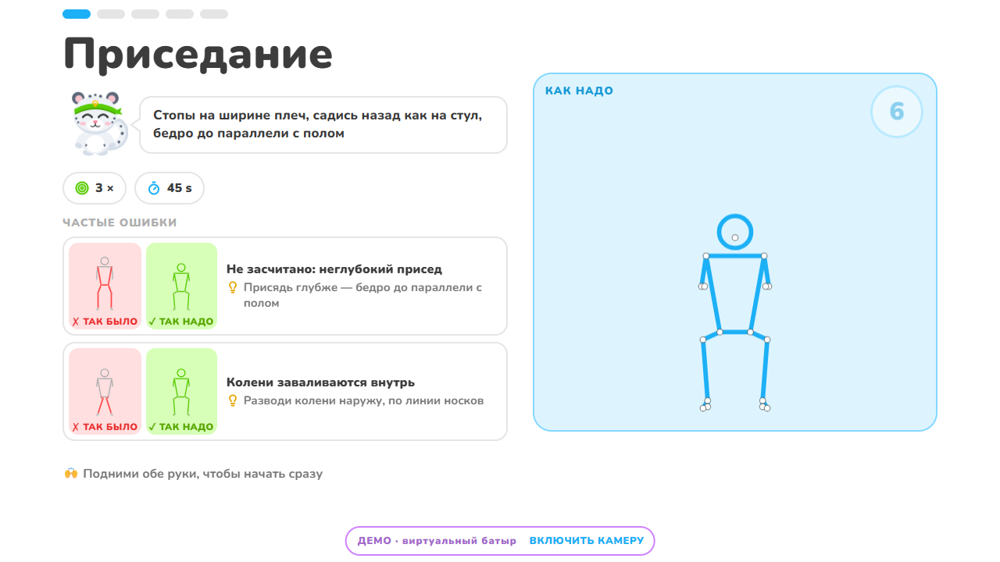
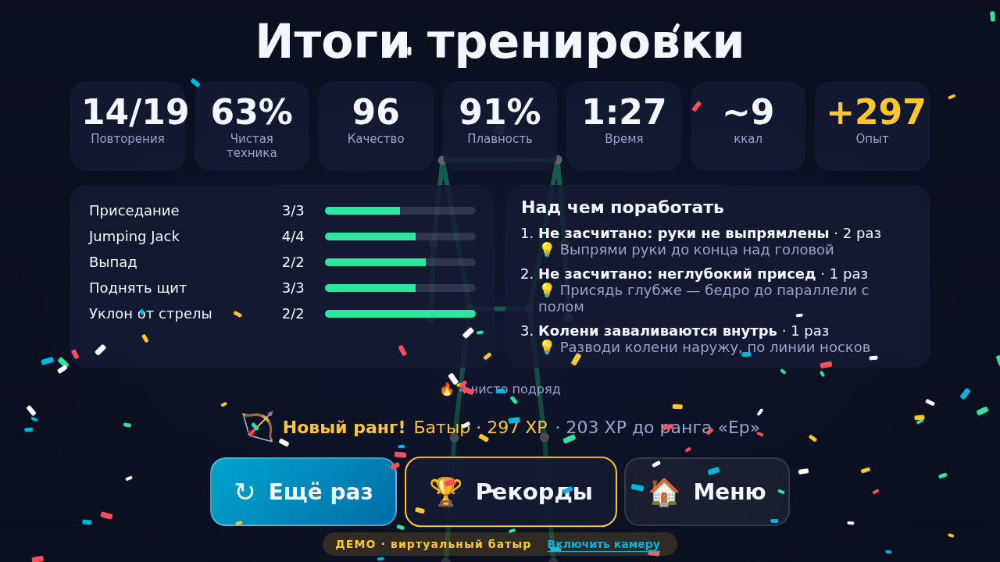
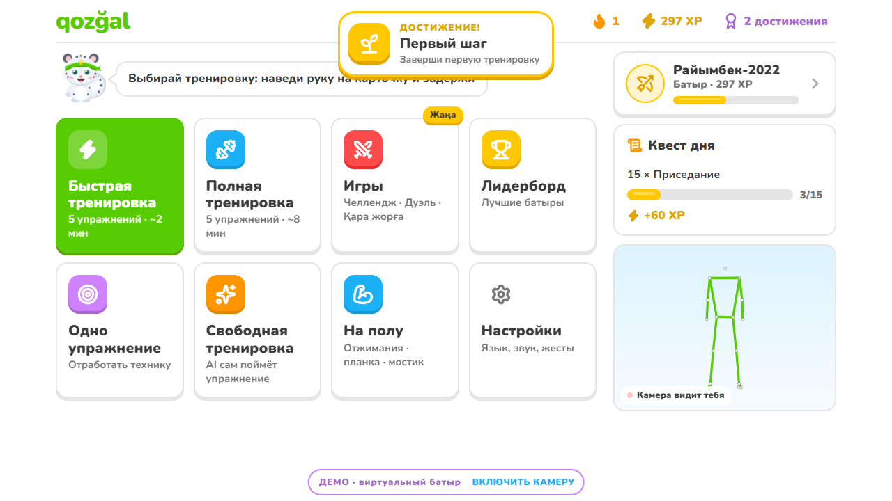
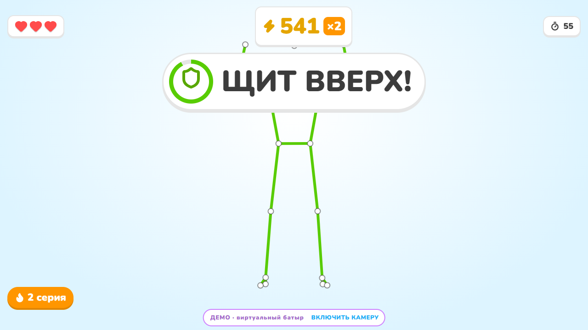
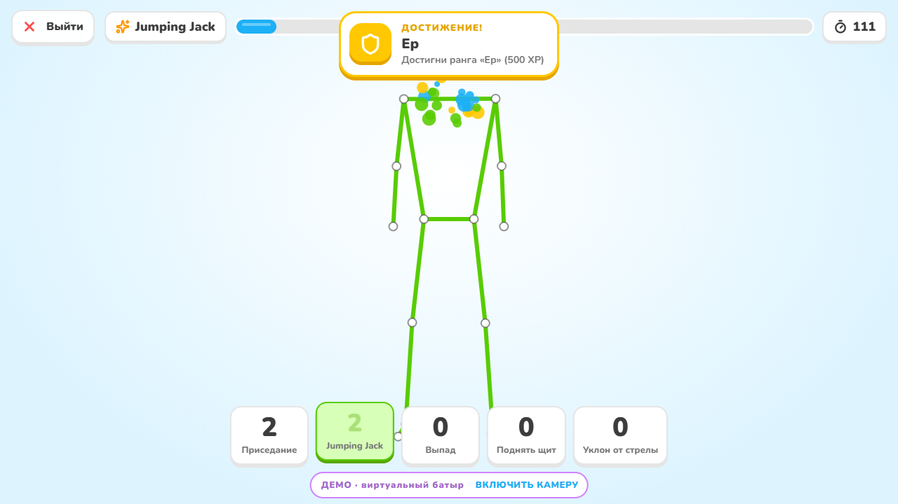
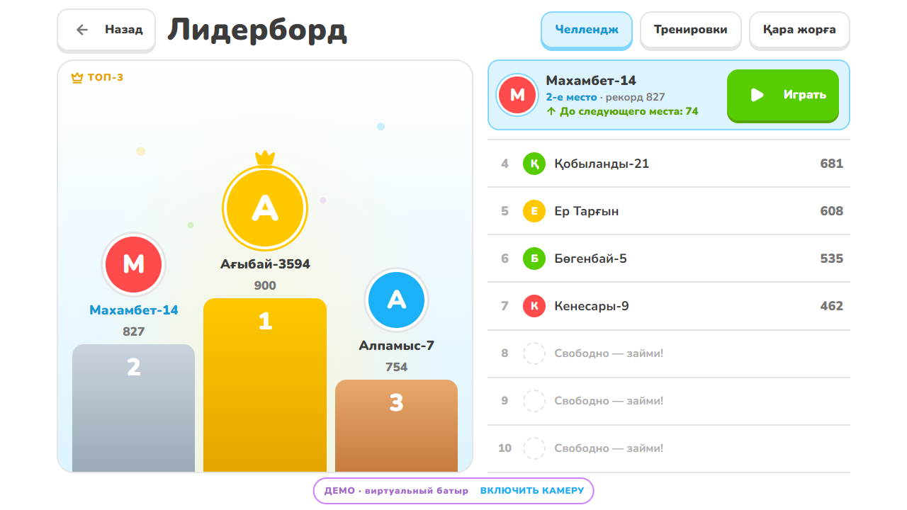

# QOZĞAL: Путь Батыра

**AI-тренер в браузере, которым управляешь телом.** Встань перед веб-камерой: приложение считает повторения,
**замечает ошибки техники и объясняет, как их исправить**. Подсказка приходит текстом и голосом,
проблемный сустав подсвечивается красным, рядом появляется стрелка направления и полупрозрачный «призрак» правильной позы.
Всё управление (меню, пауза, выбор) идёт жестами, без мыши и клавиатуры.

> ADMIT Hackathon 2026 · кейс **MOTION: камера вместо джойстика** · направление: **фитнес-тренер + игровой режим**

**Демо: [qozgal.netlify.app](https://qozgal.netlify.app)** (без камеры: кнопка «Демо без камеры») · **План команды:** [PLAN.md](PLAN.md) · **Задачи:** [docs/ISSUES.md](docs/ISSUES.md)

| Старт: тренер Барыс, один клик | Режим «ошибка»: что не так + как исправить, красные суставы, стрелки, призрак |
|---|---|
|  |  |
| **Перед упражнением: техника и частые ошибки «так было / так надо»** | **Итоги: опыт, чистая техника, топ ошибок с советами** |
|  |  |
| **Меню жестами: рука — курсор, «зеркало» камеры** | **Батыр Челлендж: команды, сердца, серия** |
|  |  |
| **Свободная тренировка: AI распознаёт упражнение** | **Рекорды, лидерборд, достижения** |
|  |  |

<sub>Скриншоты сняты автоматически (`npm run e2e -- --shots docs/img`) в демо-режиме: виртуальный батыр специально ошибается, движок сам находит ошибки.</sub>

## Дизайн

Интерфейс в духе Duolingo: светлый фон, «объёмные» кнопки с нижней гранью, толстые прогресс-бары,
округлый шрифт Nunito (self-host, поддерживает все казахские буквы: Ә Ғ Қ Ң Ө Ұ Ү Һ І).
Ведёт тренировку маскот **Барыс**, снежный барс, символ Казахстана: на нём спортивная повязка с золотым орнаментом
қошқар мүйіз. У Барыса шесть эмоций: машет при встрече, радуется чистому повтору, пугается при ошибке,
думает, когда нужно поправить кадр. Маскот нарисован вектором в коде (`src/ui/mascot`), тот же рисунок попадает в favicon и в карточку «Поделиться».

- **Ошибка = цветная карточка рядом с человеком,** а не поверх него: на широком экране человек стоит в центре кадра,
  поэтому подсказка висит сбоку и не закрывает суставы. Цвет по типу: красный — не засчитано или опасно,
  оранжевый — техника, синий — настройка кадра, зелёный — «исправил, молодец».
- **Всё достаётся рукой без прокрутки.** Жестами страницу не прокрутить, поэтому каждый экран помещается в 1280×720,
  это проверяет `npm run e2e`.
- **Только SVG-иконки, без эмодзи:** ранги, 11 достижений, команды челленджа и свои пиктограммы жестов
  («обе руки вверх», «руки крестом») выглядят одинаково в любой ОС и браузере.
- **На камере видны только нужные элементы:** прогресс повторов сверху, счёт слева, шкала глубины справа,
  мини-тренер «как надо». На телефоне раскладка вертикальная.

---

## Быстрый старт

```bash
npm install      # также скачивает модели MediaPipe в public/ (self-host, без внешнего CDN)
npm run dev      # http://localhost:5173 (на localhost камера работает без HTTPS)
```

Нужен Node.js ≥ 20 и Chrome, Edge, Safari или Firefox с веб-камерой. Камеры нет? Нажмите **«Демо без камеры»**.
Если сидите за столом и не можете отойти, в меню выберите «Одно упражнение» → **«Поднять щит»**: ему достаточно видеть верх тела.

**Деплой (Netlify):** `npm run build && npx netlify-cli deploy --prod --dir dist`, либо подключите репозиторий
в Netlify: сборка и заголовки берутся из `netlify.toml`. Модели скачиваются при `npm install` и раздаются
с нашего домена с долгим кешем. Для Vercel есть такой же `vercel.json`.

| Команда | Что делает |
|---|---|
| `npm run dev` | dev-сервер |
| `npm run build` | продакшн-сборка в `dist/` |
| `npm test` | 150+ юнит-тестов (Vitest): геометрия, фильтр, движок, все упражнения, жесты, игра, i18n, демо, kNN, DTW, лидерборд, маскот |
| `npm run e2e` | сквозной прогон в headless Chrome (нужен запущенный `npm run dev`): настоящая камера (фейковое устройство Chrome) → MediaPipe → подсказка «тебя не видно»; демо целиком: ошибка техники, итоги, рекорды, челлендж, свободная тренировка, телефон; все кнопки на экране, нет ошибок в консоли |
| `npm run train` | дообучить kNN-классификатор на записях движений команды (`tests/fixtures`) |
| `npm run lint` / `npm run typecheck` | ESLint / TypeScript strict |
| `?dev=1` в URL | инструменты разработчика: живые признаки, отладка правил, запись движений в JSON |

## Сценарий пользователя

1. **Приветствие.** Барыс машет лапой и объясняет, что будет. Единственный клик «Начать» (браузер требует жест пользователя для камеры и звука).
2. **Калибровка.** Живой чек-лист: «ты в кадре», «видно ступни», «правильная дистанция», «в центре», «лицом к камере»; в этот момент приложение запоминает игрока.
   Затем короткое обучение курсору: «подними руку, наведи на кнопку, задержи».
3. **Меню жестами:** быстрая тренировка (~2 мин), полная (~8 мин), одно упражнение, **свободная тренировка (AI сам распознаёт упражнение)**,
   Батыр Челлендж, рекорды, язык (RU/KZ/EN), звук. Вверху серия дней и **квест дня** (например, «10 выпадов, +60 XP»).
4. **Тренировка.** Перед каждым упражнением показывается анимированный «призрак» с техникой, голосовое объяснение и обратный отсчёт.
   Дальше счётчик, полоса глубины, таймер и подсказки в реальном времени.
5. **Итоги:** повторения (засчитано и попытки), % чистой техники, качество, время, ккал, опыт,
   **топ-3 ошибки с советами**, новый ранг (Жас батыр → Батыр → Ер → Алып).
6. **Рекорды и прогресс:** таблицы лидеров (сегодня / неделя / всё время; **мировая** через Supabase или этого устройства),
   11 достижений, график качества техники, имя батыра выбирается свайпом.

## Новое: режим «На полу», захват игрока, обучение

- **Режим «На полу»:** отжимания, планка и ягодичный мостик. Камера стоит сбоку на уровне пола; движок
  узнаёт позу «лёжа» по наклону линии плечи→лодыжки и следит за провисанием/подъёмом таза относительно этой линии.
  Отжимания и мостик считаются повторами, **планка — по секундам**: таймер идёт, только пока тело ровное,
  провис таза подсвечивается красным, стрелкой и «призраком» правильной позы.
- **Захват игрока (PersonLock):** MediaPipe ищет до 3 человек, а приложение следит только за тем, кто встал
  перед камерой при калибровке: совпадение по положению, размеру корпуса и **цвету одежды на торсе**.
  Прохожий на фоне больше не «уводит» скелет и не ставит счёт на паузу. «Настройки → Новый игрок» перезахватывает.
- **Плавный курсор:** «коробка досягаемости» следует за плечами медленно, фильтр One Euro убирает дрожь руки,
  курсор рисуется с частотой экрана, короткие потери руки не сбрасывают кольцо, у кнопки «липкий» край.
- **Обучение при первом входе:** экран становится серым, Барыс представляется и по очереди подсвечивает
  тренировки, режимы, челлендж, лидерборд, профиль, настройки и жесты. Главное правило: сначала — «Быстрая тренировка».
- **Лидерборд** — только лидерборд: пьедестал топ-3, остальные строками. **Профиль:** случайный ник «Имя-1234»
  выдаётся при первом входе, меняется вводом или кнопкой «Случайное имя». **Настройки:** язык, звук, шпаргалка жестов.
- **Шкала глубины в Батыр Челлендже** — как в тренировке.

## Движения → действия

| Движение | Действие | Как распознаём (своя логика) |
|---|---|---|
| **Приседание** | +1 повтор | средний угол колена в 3D, FSM `up→down→up` с гистерезисом |
| **Jumping Jack** | +1 повтор | угол плеча (рука–корпус), руки над головой, ширина стоп |
| **Выпад** | +1 на каждую ногу | углы коленей; передняя нога определяется по высоте колена |
| **Поднять щит** (жим над головой) | +1 повтор | подъём запястий относительно плеч, выпрямление локтей |
| **Уклон от стрелы** (наклоны) | +1 влево / вправо | боковой наклон корпуса, FSM `center→left/right→center` |
| **Рука-курсор + задержка 1.1 с** | «клик» по кнопке | «reach box» вокруг плеч растянут на весь экран (как у Kinect), dwell-таймер |
| **Обе руки вверх** (0.7 с) | старт / продолжить | запястья выше носа, удержание |
| **Руки крестом** (0.7 с) | пауза / назад | запястья по разные стороны от средней линии, на уровне груди |
| **Свайп** | листать (смена имени) | горизонтальная скорость запястья на уровне груди |

## Режим «Ошибка» (твист)

Каждое упражнение описано **декларативно**: фазы движения и правила. Правило задаётся условием над 3D-углами суставов
и нормированными расстояниями. Оно привязано к фазе движения, содержит **что не так** и **как исправить**,
а также суставы для подсветки и стрелки направления исправления.

**Как показываем:** карточка с конкретным текстом, голос (Web Speech API, ru/kk/en), пульсирующие красные суставы,
жёлтые стрелки, «призрак» правильной позы поверх пользователя (привязан к стопам, масштабирован по ширине плеч) и звук.
После исправления звучит «Отлично, так держать!».

**Без ложных срабатываний:** ошибка активируется, только если держится 200–700 мс, и снимается с гистерезисом.
Одновременно показывается **одна** подсказка, по приоритету *кадр → безопасность → засчитанность → техника → темп*.
Одна и та же фраза не озвучивается чаще раза в 5 с. Пока есть проблема с кадром, счёт стоит на паузе.

| Упражнение | Ошибки (все с конкретной подсказкой) |
|---|---|
| Кадр (для всех) | слишком темно · не видно человека · не видно ступней (отойди назад) · слишком далеко · у края кадра · не видно рук · стоишь боком · (для «На полу») не видно всё тело сбоку, ещё не лёг |
| Любое упражнение | «похоже, ты делаешь другое упражнение» (kNN-классификатор) + как делать нужное |
| Приседание | **не засчитано**: неглубоко · колени внутрь (valgus) · корпус наклонён · садишься на одну ногу · узкая постановка · слишком быстро |
| Jumping Jack | **не засчитано**: руки не над головой · **не засчитано**: ноги не работают · узко · согнутые локти |
| Выпад | **не засчитано**: неглубоко · заднее колено высоко · переднее колено внутрь · наклон корпуса · потеря равновесия |
| Поднять щит | **не засчитано**: руки не выпрямлены · одна рука отстаёт · прогиб в пояснице |
| Уклон от стрелы | **не засчитано**: маленький наклон · наклон вперёд вместо вбок · таз уходит · согнутые колени |

**«Так было / так надо».** Для 9 типичных ошибок рисуются два мини-скелета: неправильная поза с красными суставами
и правильная. Они показываются перед упражнением («Частые ошибки») и в итогах рядом с главной ошибкой.
Тест проверяет, что каждая «неправильная» поза действительно вызывает своё правило, а «правильная» нет.

В **Челлендже** незасчитанная попытка не отнимает жизнь: игрок слышит, что исправить, и повторяет, пока открыто окно команды.
В **итогах** показываются самые частые ошибки с советами.

## Обученная модель: kNN-классификатор поз

16-мерный дескриптор позы (углы суставов, наклоны, подъём рук, высоты коленей) и взвешенный kNN (k = 7).
Встроенная обучающая выборка генерируется детерминированно из эталонных поз с аугментацией пропорций тела
и шума суставов, поворота человека относительно камеры (±25°), наклона камеры (±10°), зеркалирования и шума глубины.
По тесту на отложенной выборке, которая сложнее обучающей (поворот 35°, наклон 15°, шум глубины 30 см), точность ≥ 95% в целом и ≥ 90% по каждому классу. Команда дообучает модель на реальных записях
через `npm run train`. Модель сглаживается по времени (голосование за 1.8 с) и нужна для подсказки «ты делаешь другое упражнение».
В `?dev=1` видно её живое предсказание.

## Свободная тренировка: AI сам понимает упражнение

Делай любые упражнения в любом порядке. Все пять детекторов следят за телом параллельно, поэтому даже первый повтор
нового упражнения не теряется. Повтор засчитывается только тому упражнению, которое kNN-модель увидела за время этого повтора:
у jumping jack руки тоже уходят над головой, но жимом он не засчитается. Плитки со счётом по каждому упражнению,
подсказки, призрак и стрелки для распознанного упражнения. Тест проверяет смешанную тренировку: каждый повтор засчитан правильно.

## Точность распознавания

- **Персональная база.** При калибровке (или по первым спокойным кадрам упражнения) система запоминает, как человек стоит
  перед этой камерой: чуть согнутые колени, камера ноутбука снизу. Это смещение вычитается из признаков.
  Коррекция ограничена и затухает к глубокому сгибанию, поэтому глубину она «не придумывает».
- **Правила только по видимым суставам.** Если колени вне кадра, «колени внутрь» не проверяется.
- **Фильтр шума.** Пересечения порога короче 350 мс не считаются повтором.
- **Сглаживание** One Euro, **гистерезис** фаз, **debounce**, **persistence** ошибок.
- **Контроль движения (DTW).** Траектория глубины каждого повтора сравнивается с плавной эталонной кривой
  (Dynamic Time Warping плюс штраф за рывки). «Пружинящие» и дёрганые повторы получают ниже, в итогах это метрика «Плавность».
- Тесты на всё это: человек с согнутыми коленями, наклон камеры 12°, скрытые колени, шумовой «повтор».

## Геймификация

XP и ранги (Жас батыр → Батыр → Ер → Алып), **11 достижений** с анимированными уведомлениями, **серия дней подряд**,
**квест дня** (одинаковый для всех в этот день, награда XP), «N чисто подряд» во время тренировки,
тренер вслух считает повторы, серия-множитель и рекорды в Челлендже. **Карточка результата** (PNG 1080×1350):
кнопка «Поделиться» открывает Web Share на телефоне или скачивает картинку на компьютере.
**Таблица лидеров:** сегодня / неделя / всё время, на этом устройстве или **мировая**
(Supabase, настраивается за 5 минут, см. [docs/LEADERBOARD.md](docs/LEADERBOARD.md)). Демо-режим ничего не записывает.

## Батыр Челлендж (игра)

60 секунд, случайные команды «ПРИСЕД!», «ПРЫЖОК!», «ЩИТ ВВЕРХ!», «УКЛОН ВЛЕВО/ВПРАВО!». Окно реакции постепенно сужается (5 → 3 с).
Очки начисляются за попадание, бонусы за чистую технику и скорость, серия даёт множитель ×1–×4, всего 3 жизни.
Рекорды сохраняются.

## Демо без камеры

«Виртуальный батыр» выдаёт синтетические позы через тот же интерфейс, что и камера. Он делает хорошие повторения вперемешку
с типичными ошибками. **Движку ничего не сообщается**: он сам находит ошибки, как у живого человека.
Демо включается со стартового экрана и с экрана ошибки камеры. Если у жюри не заработает камера, работу режима «ошибка» всё равно будет видно.

## Архитектура

```
Камера ─► MediaPipe PoseLandmarker (WASM + GPU→CPU fallback, self-hosted модели)
      ─► One Euro Filter (сглаживание) ─► FrameFeatures (3D-углы, наклоны, пропорции, видимость) + яркость кадра
      ─┬► GestureDetector ─► курсор + dwell, руки вверх, крест, свайп ─► навигация UI
       ├► kNN ExerciseRecognizer ─► «это другое упражнение»
       └► ExerciseRunner: FSM фаз ─► подсчёт повторений ─► RuleTracker (правила кадра, persistence/hysteresis)
                                  └► правила повторения (засчитано/нет, качество) ─► FeedbackArbiter
                                        ─► карточка + голос + красные суставы + стрелки + призрак + звук
DemoActor (синтетические позы) ─► тот же PoseSource ─► весь пайплайн без камеры
```

```
src/
  core/        камера, MediaPipe, One Euro, геометрия, признаки, эталонные позы
  engine/      ExerciseRunner, DSL правил, RuleTracker, FeedbackArbiter, setup-правила, персональная база, DTW
  exercises/   squat · jumpingJack · lunge · press · sideBend (config, правила, эталон)
  gestures/    курсор (reach box), dwell, жесты тела
  ml/          kNN-классификатор поз, синтетический датасет, распознаватель упражнения
  game/        программы, итоги, XP/ранги, Челлендж, свободная тренировка, ачивки, квест дня, серия
  demo/        виртуальный батыр и хореография ошибок
  storage/     прогресс, рекорды, лидерборд (локальный + Supabase), имена батыров
  audio/       синтезированные звуки (домбра, Karplus–Strong), голос
  i18n/        ru / kk / en (полнота словарей проверяется типами)
  ui/          экраны, оверлей (скелет, стрелки, призрак, частицы), dwell-кнопки, маскот Барыс, тема
  dev/         запись движений в JSON
tests/         помощники, записанные фикстуры (tests/fixtures)
```

**Своя логика (не демо библиотеки):** kNN-классификатор поз с собственной обучающей выборкой, One Euro Filter, признаки в 3D world-координатах с нормировкой по росту и плечам,
конечные автоматы с гистерезисом и debounce, DSL правил ошибок, арбитр подсказок, оценка качества повторения,
reach-box курсор, dwell-клик, детекторы жестов, правила игры, синтетический генератор поз для тестов и демо.

**Качество:** TypeScript strict, ESLint, Prettier, 150+ юнит-тестов и сквозной e2e-прогон в headless Chrome. Каждое упражнение проверяется на эталонных
и «ошибочных» повторениях. Отдельный тест гарантирует, что демо-хореография действительно вызывает ошибки.
Записанные движения людей (`?dev=1` → rec) автоматически становятся регрессионными тестами.
CI в GitHub Actions: lint → typecheck → test → build.

## Приватность

Видео **не покидает устройство**: распознавание выполняется локально в браузере, кадры никуда не отправляются.
Прогресс хранится только в `localStorage`. MediaPipe по умолчанию шлёт в Google анонимную статистику производительности.
На продакшене это заблокировано заголовком `Content-Security-Policy: connect-src 'self' …` (`netlify.toml`, `vercel.json`).

## Бонусы

- Собственная логика распознавания и обученная модель: правила, FSM, фильтры, жесты, kNN-классификатор
- Таблица рекордов (локальная и мировая), прогресс, ранги, 11 достижений, серия дней, квест дня, история с графиком
- Адаптация под телефон: портретная раскладка, lite-модель на мобильных, фронтальная камера
- Звук и визуальные эффекты: домбра-звуки, голос, частицы, конфетти, маскот Барыс с шестью эмоциями
- Сверх того: Три языка, демо-режим без камеры, призрак правильной позы, свободная тренировка с распознаванием упражнения, DTW-оценка плавности

## Команда и честность разработки

Вся логика проекта написана после старта хакатона (28.09.2026, 07:00 Астана). Заранее подготовленных заготовок нет.
Использованы готовые библиотеки: MediaPipe Tasks Vision (модели Pose Landmarker), React, Vite, Zustand, Vitest,
lucide-react (иконки), шрифт Nunito (@fontsource), puppeteer-core (только для e2e-прогона).
Всё остальное, включая признаки, правила, движок, жесты, игру, демо, звук и UI, написано командой.
